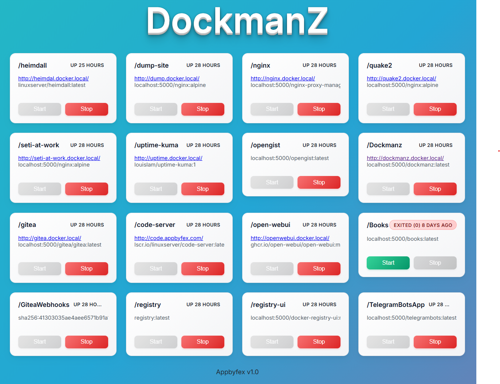

# Dockmanz

Dockmanz is a lightweight web app for managing Docker containers with a simple, interactive interface.

## Features

- View and manage Docker containers from your browser
- Modern, responsive UI built with Razor Components
- Easy to deploy and use

## Getting Started

1. Clone the repository.
2. Build and run the app using Docker Compose

## Screenshot

